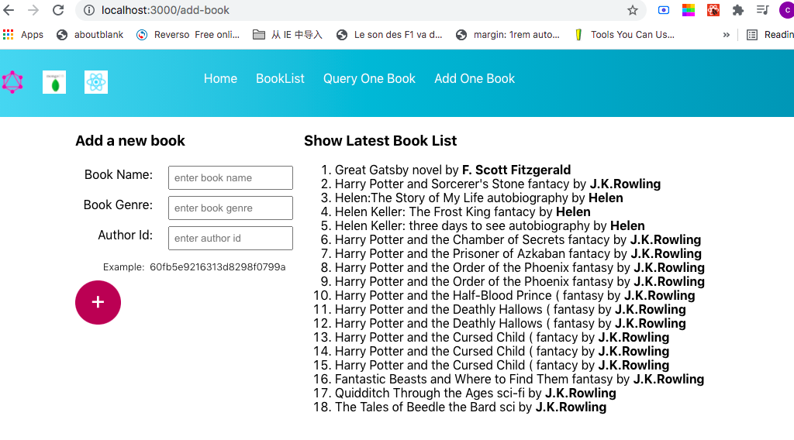

## front-end

- react + apollo client + graphQL
- $npm install @apollo/client graphql
- [apollo client for react is located at ]/(https://www.apollographql.com/docs/react/get-started/)

## back-end

- node.js + express + mongoose + graphQL
- [baack end source code is located at ]/(https://github.com/cxxyao2/graphql_mongo1)

## screenshot

- 

## back-end code extract:
```
const RootQueryType = new GraphQLObjectType({..});

const RootMutationType = new GraphQLObjectType({
  name: 'Mutation',
  description: 'Root Mutation',
  fields: () => ({
    addBook: {
      type: BookType,
      args: {
        name: { type: new GraphQLNonNull(GraphQLString) },
        genre: { type: new GraphQLNonNull(GraphQLString) },
        authorId: { type: new GraphQLNonNull(GraphQLID) },
      },
      resolve: (parent, args) => {
        let book = new Book({
          name: args.name,
          genre: args.genre,
          authorId: args.authorId,
        });
        return book.save();
      },
    },
  }),
});

module.exports = new GraphQLSchema({
  query: RootQueryType,
  mutation: RootMutationType,
});

```

## front-end code extract:
### graphQL queries
```
import { gql } from '@apollo/client';
const AddBook = gql`
  mutation addBook($name: String!, $genre: String!, $authorId: ID!) {
    addBook(name: $name, genre: $genre, authorId: $authorId) {
      name
      genre
      author {
        name
      }
    }
  }
`;
export {  AddBook, ... };
```

### component
```
import { useMutation, useQuery } from '@apollo/client';
import { AddBook, GetBooksQuery } from '../queries/queries';
function AddOneBook(props) {
  const [addBook, { data }] = useMutation(AddBook);
  const { loading, error, data: booklist } = useQuery(GetBooksQuery);

    const addBookByClick = async (e) => {
    e.preventDefault();
    await addBook({
      variables: {
        name: bookName.value,
        genre: bookGenre.value,
        authorId: authorId.value,
      },
    });

    e.target.reset();
  };
  
  return 
  (
     <form onSubmit={(e) => addBookByClick(e)}>...<form>
     <div className="show_area">
        <h3>Show Latest Book List</h3>
        {booklist && (
          <ol>
            {booklist['books'].map((book) => (
              <li key={book.id}>
                {book.name} {book.genre} by <strong>{book.author.name}</strong>
              </li>
            ))}
          </ol>
        )}
      </div>
  );

}
```
